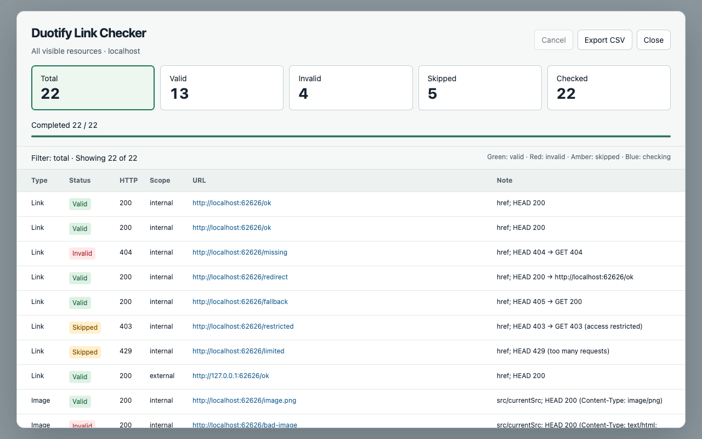

<p align="center"></p>

# Duotify Link Checker

[](https://github.com/doggy8088/duotify-link-checker/actions/workflows/ci.yml)
[](LICENSE)

一鍵檢查目前網頁可見的超連結、圖片、CSS 圖片、影片與音訊網址。以框線標示結果，在頁面上的報表篩選問題，並匯出 CSV。

A Chrome extension that checks visible links and media, highlights broken resources, and gives you a filterable report directly on the page.

👉 [Install from Chrome Web Store](https://chromewebstore.google.com/detail/gnljkppoadbieiadmhfkpembngdkbmjb)



## 功能

- 檢查全部資源，或只檢查不同 origin 的外部資源。
- 支援 `img/currentSrc`、CSS 背景、border、list marker、mask、偽元素圖片，以及 video/audio。
- HEAD 失敗後以 GET 確認；GET 取得標頭後即取消本文下載。
- 圖片必須回傳有效的 `image/*` MIME，避免把 HTTP 200 的登入頁誤認為圖片。
- 檢查頁內錨點；特殊協定與無法確定的網路結果有獨立狀態。
- 8 路並行、重複網址去重、分批處理 DOM、取消、重新開啟報表與清除標示。
- 可用鍵盤操作的報表、結果篩選與 UTF-8 CSV 匯出。
- 不含分析追蹤、不傳回開發者伺服器、不儲存瀏覽紀錄。

## 安裝與使用

可直接從 [Chrome 線上應用程式商店](https://chromewebstore.google.com/detail/gnljkppoadbieiadmhfkpembngdkbmjb) 安裝。

也可從 [GitHub Releases](https://github.com/doggy8088/duotify-link-checker/releases) 下載 ZIP，解壓後前往 `chrome://extensions`，啟用「開發人員模式」，按「載入未封裝項目」，選擇含 `manifest.json` 的資料夾。

開啟一般 HTTP/HTTPS 網頁，點選工具列圖示，再選 **Check all resources** 或 **Check external resources**。檢查不會自動執行。報表中的 Total / Valid / Invalid / Skipped / Checked 可篩選結果；Close 或 Escape 只關閉報表，Show report 可重新開啟；Cancel 會停止工作。完成後以 Clear marks 清除報表與框線。

需要 Chrome 120 以上。可見表示有渲染面積且未隱藏，包含捲動區域中尚未出現在螢幕內的元素。iframe 與頁面自身的 Shadow DOM 不在掃描範圍。

HTTP 請求不攜帶登入 Cookie 或 Referer；登入、驗證碼、防盜連或防機器人網站可能顯示 Skipped，或與一般瀏覽結果不同。Valid 表示 HTTP/MIME 檢查通過，不保證內容正確或媒體可播放。詳見[限制與遷移差異](docs/migration.md)。

## 開發

```sh
npm ci
npx playwright install chromium
npm run check
```

`npm run build` 產生可載入的 `dist/`；`npm run package` 產生 `artifacts/` ZIP 與 SHA-256。所有瀏覽器端程式均隨套件提供，沒有遠端程式碼或執行時相依套件。

[完整開發文件](docs/README.md) · [測試](docs/testing.md) · [發布流程](docs/publishing.md) · [商店文案](CHROMEWEBSTORE.md) · [隱私權政策](docs/privacy-policy.md)

## 授權

[MIT](LICENSE) — Copyright © 2026 Will 保哥
