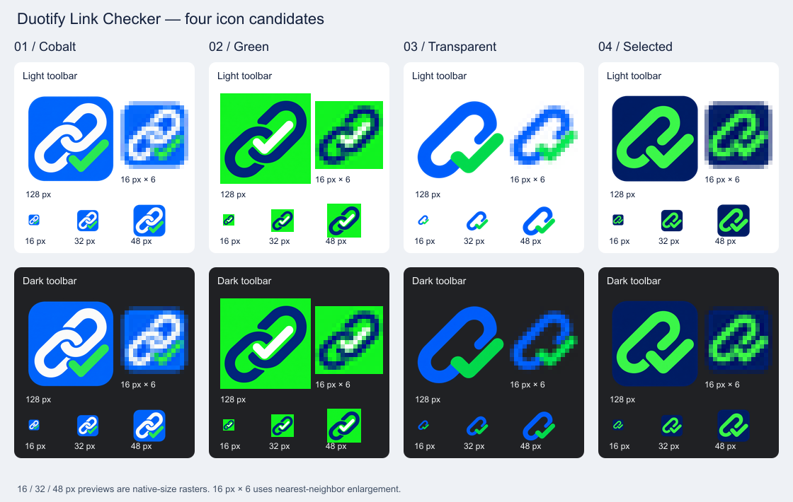

# 圖示與商店截圖

2026-10-04 使用內建 imagegen 工具製作四個圖示方向，未使用 CLI/API fallback。完整提示詞與透明區域修正記錄保存在 [icon-variants/prompts.md](assets/icon-variants/prompts.md)。

**採用第 4 版：深藍底、亮綠色鏈結勾號。** 以 16、32、48 像素在淺色及深色背景上的視覺比較為依據：此版本使用兩種主要色彩與較簡單的輪廓，鏈結與勾號在縮小後仍可辨認。這是設計選擇，未進行使用者辨識率測試。

<!-- prettier-ignore -->
* * *

## 四個版本

| 版本 | 方向                           | 原始素材                                                                    |
| ---- | ------------------------------ | --------------------------------------------------------------------------- |
| 1    | 藍底白鏈結，綠色勾號           | [01-cobalt-link.png](assets/icon-variants/01-cobalt-link.png)               |
| 2    | 不透明綠底，深藍鏈結與白色勾號 | [02-green-link.png](assets/icon-variants/02-green-link.png)                 |
| 3    | 透明底，亮藍鏈結與綠色勾號     | [03-open-link-check.png](assets/icon-variants/03-open-link-check.png)       |
| 4    | 深藍底，亮綠色鏈結勾號；已採用 | [04-unified-link-check.png](assets/icon-variants/04-unified-link-check.png) |

比較圖中的 16、32、48 像素圖示維持實際尺寸；16 像素的六倍放大使用 nearest-neighbor，方便檢查縮小後的像素輪廓。執行 `node scripts/icon-preview.mjs` 可重建比較圖。

<!-- prettier-ignore -->
* * *

## 正式圖示

原始 PNG：[assets/icon-source.png](assets/icon-source.png)，與第 4 版素材相同。深藍底板與主圖案保留完整色塊，外角保留 alpha。使用 Sharp 等比例縮小，產生 `public/icons/icon-16.png`、`icon-32.png`、`icon-48.png`、`icon-128.png`。

`npm run icons` 可重建正式圖示與宣傳圖。manifest 的工具列及擴充功能清單參照各自對應的實際尺寸；彈出視窗與 README 也使用這組素材。尺寸與使用方式依 [Chrome 官方圖示文件](https://developer.chrome.com/docs/extensions/reference/manifest/icons)及 [action 圖示文件](https://developer.chrome.com/docs/extensions/reference/api/action)確認。

<!-- prettier-ignore -->
* * *

## 宣傳圖

商店宣傳圖已同步換成第 4 版圖示，保留原本的淺薄荷綠背景與周圍鏈結裝飾。原始檔為 [assets/promo-source.png](assets/promo-source.png)，正式輸出為 [assets/promo-440x280.png](assets/promo-440x280.png)，RGB、無 alpha。完整生成提示詞保存在 [prompts.md](assets/icon-variants/prompts.md)。

<!-- prettier-ignore -->
* * *

## 截圖檔案

- `assets/screenshot-report.png`：完整結果報表，1280×800。
- `assets/screenshot-invalid.png`：Invalid 篩選結果，1280×800。

由真實擴充功能 E2E 測試在本機 fixture 擷取。`npm run test:e2e` 會重新產生。這次圖示變更不影響報表內容；若更新含舊圖示的彈出視窗或工具列截圖，應重新擷取。localhost 隨機連接埠可能隨測試改變。
