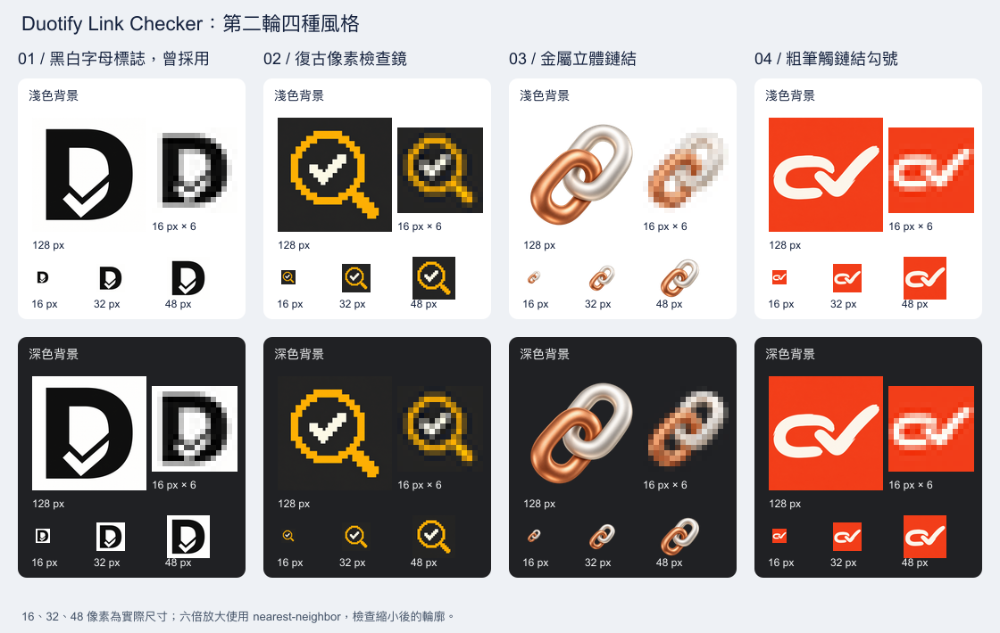

# 圖示與商店截圖

2026-10-04 使用內建 imagegen 工具重新製作四種不同風格，未使用 CLI/API fallback。[第二輪設計記錄](assets/icon-redesign-2/README.md)與[完整提示詞](assets/icon-redesign-2/prompts.md)保存在專案內。

[第三輪四個候選方向](assets/icon-redesign-3/README.md)提供幾何拼接、折紙鏈結、焦點掃描與玻璃鏈結，供使用者選擇，尚未套用到正式素材。[比較圖](assets/icon-redesign-3/comparison.png)與[提示詞](assets/icon-redesign-3/prompts.md)一併保存。

**正式圖示採用第二輪第 1 版：黑白 D 字母標誌。** D 對應 Duotify 名稱，字形中的勾號表達檢查；粗輪廓在 16 像素下仍能辨認。選擇依據為淺色與深色背景上的實際縮小比較，未進行使用者辨識率測試。

<!-- prettier-ignore -->
* * *

## 第二輪四種風格

| 版本 | 風格                               | 原始素材                                                                |
| ---- | ---------------------------------- | ----------------------------------------------------------------------- |
| 1    | 黑白字母標誌，D 與勾號結合；已採用 | [01-swiss-monogram.png](assets/icon-redesign-2/01-swiss-monogram.png)   |
| 2    | 復古像素檢查鏡，階梯輪廓與白色勾號 | [02-pixel-inspector.png](assets/icon-redesign-2/02-pixel-inspector.png) |
| 3    | 金屬立體鏈結，銅色與珍珠白金屬環   | [03-sculpted-link.png](assets/icon-redesign-2/03-sculpted-link.png)     |
| 4    | 粗筆觸鏈結勾號，朱紅背景與米白筆觸 | [04-brush-link.png](assets/icon-redesign-2/04-brush-link.png)           |

比較圖中的 16、32、48 像素圖示維持實際尺寸；16 像素的六倍放大使用 nearest-neighbor，方便檢查縮小後的像素輪廓。執行 `node scripts/icon-preview.mjs 2` 可重建。

第一輪素材保留在 [assets/icon-variants/](assets/icon-variants/prompts.md)，其深藍底、亮綠色鏈結勾號已由本輪第 1 版取代。[第一輪比較圖](assets/icon-variants/comparison.png)可由 `node scripts/icon-preview.mjs 1` 重建。

<!-- prettier-ignore -->
* * *

## 正式圖示

原始 PNG：[assets/icon-source.png](assets/icon-source.png)，與第二輪第 1 版素材相同。原圖為不透明 RGB，白色背景、黑色 D 與融入字形的勾號；使用 Sharp 等比例縮小，產生 `public/icons/icon-16.png`、`icon-32.png`、`icon-48.png`、`icon-128.png`。正式圖示統一輸出 RGBA；RGB 原稿加入不透明 alpha，已有 alpha 的原稿則保留其透明資訊。

`npm run icons` 可重建正式圖示與宣傳圖。manifest 的工具列及擴充功能清單參照各自對應的實際尺寸；彈出視窗與 README 也使用這組素材。尺寸與使用方式依 [Chrome 官方圖示文件](https://developer.chrome.com/docs/extensions/reference/manifest/icons)及 [action 圖示文件](https://developer.chrome.com/docs/extensions/reference/api/action)確認。

<!-- prettier-ignore -->
* * *

## 宣傳圖

商店宣傳圖同步採用黑白 D 字母標誌，以白色背景與置中的黑色字形延續本輪的排版風格。原始檔為 [assets/promo-source.png](assets/promo-source.png)，正式輸出為 [assets/promo-440x280.png](assets/promo-440x280.png)，RGB、無 alpha。完整生成提示詞保存在 [prompts.md](assets/icon-redesign-2/prompts.md)。

<!-- prettier-ignore -->
* * *

## 截圖檔案

- `assets/screenshot-report.png`：完整結果報表，1280×800。
- `assets/screenshot-invalid.png`：Invalid 篩選結果，1280×800。

由真實擴充功能 E2E 測試在本機 fixture 擷取。`npm run test:e2e` 會重新產生。這次圖示變更不影響報表內容；若更新含舊圖示的彈出視窗或工具列截圖，應重新擷取。localhost 隨機連接埠可能隨測試改變。
