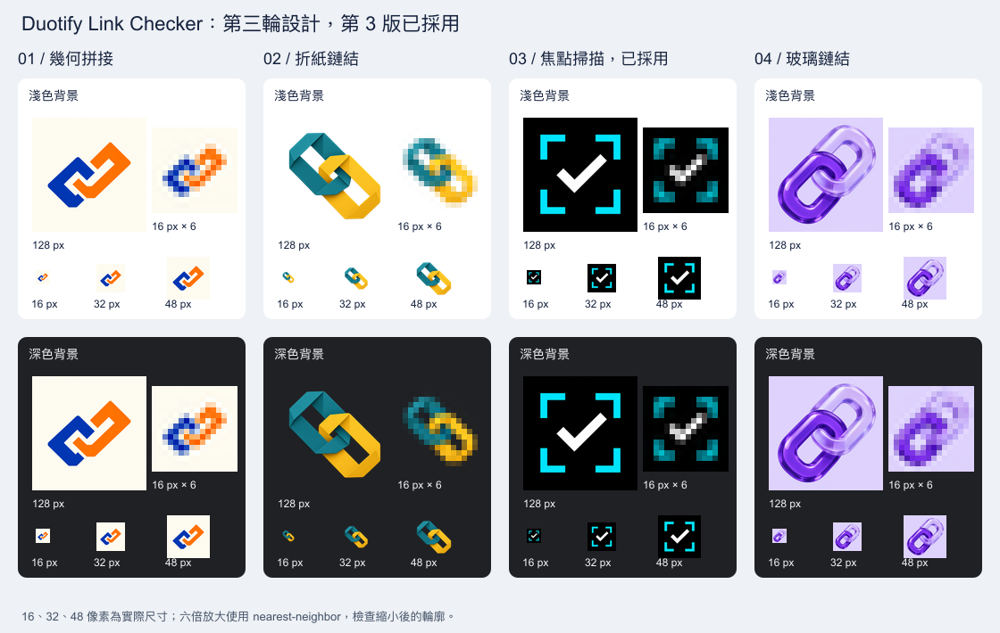

# 第三輪圖示設計

使用內建 imagegen 分別生成幾何拼接、折紙鏈結、焦點掃描與玻璃鏈結四個方向。原始尺寸均為 1254×1254 PNG。

**使用者選定第 3 版焦點掃描，已套用到正式圖示與宣傳圖。** 原圖的黑色背景、青色對焦括角與中央白色勾號保持不變；正式圖示由原圖等比例縮小。

<!-- prettier-ignore -->
* * *

| 版本 | 方向     | 識別線索                           | 原始素材                                   |
| ---- | -------- | ---------------------------------- | ------------------------------------------ |
| 1    | 幾何拼接 | 藍色與橘色模組、粗幾何接點         | [01-modular-link.png](01-modular-link.png) |
| 2    | 折紙鏈結 | 藍綠色與黃色紙帶、角形折疊鏈環     | [02-origami-link.png](02-origami-link.png) |
| 3    | 焦點掃描 | 青色對焦括角、中央白色勾號；已採用 | [03-focus-scan.png](03-focus-scan.png)     |
| 4    | 玻璃鏈結 | 紫色玻璃交扣鏈環、透明材質表現     | [04-glass-link.png](04-glass-link.png)     |

16、32、48 像素圖示維持實際尺寸；16 像素的六倍放大使用 nearest-neighbor，便於檢查縮小後的輪廓。第 2、4 版的折疊與折射細節會隨縮小減少；比較時以主要輪廓為判斷依據。未進行使用者辨識率測試。

<!-- prettier-ignore -->
* * *

在專案根目錄執行 `node scripts/icon-preview.mjs 3` 可重建本輪比較圖。[完整提示詞](prompts.md)保存四個方向的生成內容；原始圖檔保留內建工具輸出的色彩與透明資訊。

正式原稿 [../icon-source.png](../icon-source.png) 與第 3 版原始素材逐位元組相同。執行 `npm run icons` 可產生 16、32、48、128 像素圖示，並將同一原圖等比例置中於黑色橫式畫布，產生 1760×1120 宣傳原稿與 440×280 宣傳圖。[正式素材記錄](../../assets.md)說明尺寸與使用位置。
